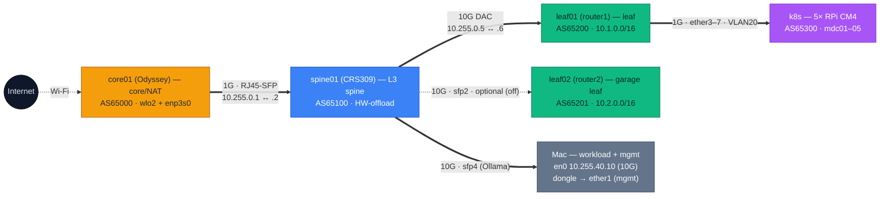
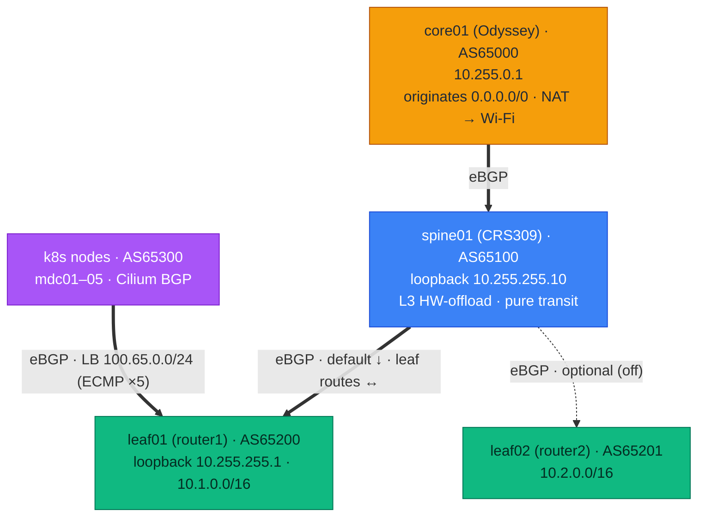

# Micro Datacenter Project
This is a project to compile the necessary information to build a personal **micro datacenter** — a real, fully-functioning datacenter, shrunk down until it fits in a corner and sips power. It's largely for educational purposes, but it can just as well run a personal lab or host real services (websites, files, etc).

> **How this doc is organized:**
> 1. **The intent** — what a micro datacenter is and why you'd want one.
> 2. **The design principles** — the low-power, bare-metal philosophy behind it.
> 3. **A minimal build** — a concrete starter bill of materials (3 nodes + one router) with costs.
> 4. **The building blocks** — the stack you'd run on it, framed as things to learn.
> 5. **How I ended up building mine** — the specific, opinionated system I run, including an AWS-style private cloud. Your build will differ; this is one worked example.

## What is a micro datacenter?
This is largely opinion, but for the purposes of this project, we'll define it as the following.

_A micro datacenter is a fully functioning, ultra low power, and distributed datacenter. It contains all the functionality of a real datacenter, but small enough that you can run it off a 20A 110V outlet._

Also, it's bare metal...

## But why?
Most folks, myself included, have always run some form of lab at home. This comes with a host of challenges and annoyances.
- Enormous power requirements for anything more than 1/2 a rack of servers
- Expensive, power hungry servers
- Old servers that are out of support, clunky, expensive to fix and upgrade, etc
- Overloading those servers with VMs
- Many folks run VMware ESX or Proxmox, but that can be pricey
- Upgrades? What's that?
  - Who actually has the funds to regularly upgrade their lab?

A micro datacenter flips all of that: tiny ARM nodes that cost ~$75 each, draw a few watts, mount without cases, and grow one node at a time. You get the *concepts* of a real datacenter — distributed compute, object storage, software-defined networking, BGP, load balancing — without the power bill, the noise, or the sunk cost in gear that's obsolete before it's paid off.

## Design principles
Everything here follows a few rules:

- **Ultra low power.** The whole thing should idle around the draw of a single light bulb and run off one wall outlet.
- **Bare metal, distributed.** Many small nodes beat one big hypervisor. Failure domains are small and cheap to replace.
- **No bulky, failure-prone parts.** No PoE HATs (their fans fail and they eat HAT space), no cases (better airflow), no spinning disks.

### The basic node
The reference compute node is deliberately minimal:
- A **PoE-powered Raspberry Pi CM4** (no separate power brick — power rides in over Ethernet)
- An **NVMe disk** attached over PCIe (not USB) — the carrier board mounts it on the underside. NVMe solves much of the IO issues of SD Cards and emmc. 
- **Vertically mounted on DIN rails**, no case — better airflow and cooling and easily movable (not huge 1U+ servers)

This ultra-low-profile design dispenses with the bulky, failure-prone PoE HATs and keeps the rack free of USB cable clutter. The disk and PoE take up no HAT space, and NVMe. One node is small, cheap, and entirely replaceable — exactly what you want as a failure domain.

# A minimal build
You don't need a rack, a spine switch, or a dozen nodes to start. The smallest sensible micro datacenter is **three nodes and one router**:

- **3× Raspberry Pi CM4 nodes** — three gives you a real distributed system: a quorum for clustered control planes (k8s, etcd, object storage), with one node able to fail. CM4s are the most cost-effective node by a wide margin.
- **1× [MikroTik RB5009UPr+S+IN](https://mikrotik.com/product/rb5009upr_s_in)** — this single box is your **router, your PoE source, and your internet edge** all at once. Plug your home internet into its 2.5 G WAN port; it powers and switches the three nodes over its 8 PoE-out ports. No separate PoE switch, no spine, no edge box needed at this size.

### Bill of materials (June 2026 pricing)
| item | qty | ~unit | subtotal |
|---|---|---|---|
| [MikroTik RB5009UPr+S+IN](https://mikrotik.com/product/rb5009upr_s_in) — router + PoE + WAN edge | 1 | ~$250 | ~$250 |
| [Raspberry Pi CM4 (8 GB, no Wi-Fi)](https://www.adafruit.com/product/4564) | 3 | ~$75 | ~$225 |
| [Waveshare CM4-IO-BASE-B carrier](https://www.waveshare.com/cm4-io-base-b.htm) | 3 | ~$43 | ~$129 |
| [NVMe 512 GB (2242)](https://www.amazon.com/Sabrent-DRAM-Less-Internal-Performance-SB-1342-512/dp/B07XVR1KKR/) | 3 | ~$80 | ~$240 |
| [PoE USB-C splitter (5 V / 4 A)](https://www.amazon.com/dp/B0CHW5K5F4) | 3 | ~$22 | ~$66 |
| [DIN-rail mount](https://www.amazon.com/Winford-Engineering-Raspberry-L-Bracket-Compliant/dp/B083YSWYW1/) | 3 | ~$16 | ~$48 |
| Cat6 patch cables | 3 | ~$3 | ~$9 |
| | | **Total** | **~$970** |

That's a **3-node cluster with a real router for under $1,000**, drawing roughly **30 W** total (3 nodes at ~6 W + the RB5009 at ~12 W) — less than a single incandescent bulb.

> ⚠️ **A note on storage cost (2026):** an ongoing NAND flash crisis (AI/datacenter demand) has roughly *doubled* SSD prices year over year. The 512 GB NVMe above keeps the per-node cost down; a 1 TB drive now runs ~$150 on its own. Storage is the dominant cost mover in any node — buy drives sooner rather than later if you plan to scale.

**Be careful with PoE USB-C splitters** — not all are equal. The one linked is 5 V at 4 A. The [UCTRONICS](https://www.amazon.com/UCTRONICS-PoE-Splitter-USB-C-Compliant/dp/B087F4QCTR/) is only 2.4 A, and I've had some fail; spend a little more for a beefier splitter, especially as you add nodes.

From here you scale by adding nodes (the RB5009 powers up to ~8), then a rack, then a spine switch and more routers. The rest of this doc covers that growth — and where my own build went with it.

# Scaling up: the rack
You don't need a cabinet for three nodes on a shelf, but once you grow you'll want one. For a half-cabinet build with room for battery backup / UPS:

- [Mobile 1/2 cabinet](https://www.amazon.com/NavePoint-Server-Cabinet-Casters-Shelves/dp/B01I48EJOW/) (or a 1/4 cabinet for a smaller version): $374.00
- 2× [6U DIN Mount with cable management](https://www.amazon.com/Rackmount-Din-Rail-Panel-6U/dp/B00SG3PGWK/): $199.00

**Rack total: $574.00**

## Density
With the node design above you can fit roughly **18 nodes into 6U** (assuming ~2" width per node). SSD instead of NVMe can be cheaper but needs more DIN mounts and rack space, plus the cost of USB dongles.

Basically you need a 24-port switch (or an 8-port PoE router like the RB5009, scaled out) for every 6U. So in 7U you'd have networking, 18 nodes, and cable management. In a 22U cabinet, that's *54 nodes*… now we're talking.

# The building blocks
A micro datacenter is as much about the software stack as the hardware. These are the pieces you'll learn and run — described here as concepts; see *How I ended up building mine* for the specific tools I chose.

## Routing & BGP
[FRRouting](https://frrouting.org/) is an open-source routing stack you can run on any Linux host — far cheaper than a purpose-built switch/router, and the whole point is to learn the internals. The interesting design is a **routed spine/leaf BGP fabric**: every box runs BGP with its own private ASN, transit links are routed `/30`s, and LAN edges are VLAN-segmented.

This matters because BGP is the underpinning of real cloud networking — not just IGWs and route tables, but the **eVPN/VXLAN encapsulation** that makes multi-tenant VPCs work. Build it yourself once and the cloud stops being magic.

## Public IP space & IPv6
So you want to learn IPv6? You can get your own ASN and IP space for about $1000 (ASN ~$500, a /36 IPv6 ~$500 — the smallest ARIN allocates at the time of writing). It seems steep, but it's a fraction of what you'd spend buying and powering rackmount servers. With a BGP routing setup you can advertise that space through a provider like Equinix Metal, or use AWS BYOIP + [Transit Gateway Connect](https://aws.amazon.com/about-aws/whats-new/2020/12/introducing-aws-transit-gateway-connect-to-simplify-sd-wan-branch-connectivity/). Already have IPv4 space? You can advertise that too.

**No static IP from your home ISP?** Tunnel out with WireGuard or IPSec to an Equinix Metal host or to AWS (anything that can speak BGP).

## Elastic IPs
An Elastic IP, in AWS terms, is just a public IP NAT'd to a private one. With no fancy offload NICs, you achieve the same thing by **running BGP on every node**: for Kubernetes workloads, [Cilium](https://cilium.io/) advertises the service IP via BGP to the core network and out to the internet (if you're doing public peering).

## Kubernetes
Kubernetes in a home lab has always been a struggle — too much infrastructure to run every service. The balance I've found is [k3s](https://k3s.io/): lightweight, with first-class **Cilium** support that ties directly into the routing stack above.

## Distributed storage
How do you do persistent and shared object storage? [MinIO](https://min.io/) is the simplest S3-like option and far less work than GlusterFS or Ceph. [Garage](https://garagehq.deuxfleurs.fr/) is another lightweight, S3-compatible choice that's a better fit for small, replicated, multi-node setups.

## Firewall
Keep it simple to understand it — no PFSense. Do it the hard way for learning: `nftables` / `bpfilter` / `iptables` on the hosts, forward-chain policy on the routers, and Cilium NetworkPolicy in-cluster (default-deny between segments).

## Server management & imaging
[Tinkerbell](https://tinkerbell.org/) automates DHCP / NETBOOT / PXE provisioning of physical hosts. To keep costs down you can run it on your desktop in VMs to start, or on a shared multi-purpose node (DHCP, DNS, image store, etc).

---

# How I ended up building mine
Everything above is the concept and a starter path. This section is the specific, opinionated system **I actually run**. It's one worked example — your choices will and should differ — but it shows how far the idea goes: the rack below now runs as a small **AWS-style private cloud**.

## The cloud it became: AWS → self-hosted
Object storage, a container registry, certificate issuance, software-defined networking, DNS, load balancing, GitOps delivery — all self-hosted, all on an internal `.internal` TLD, no public cloud bill.

| AWS service | Self-hosted equivalent | Notes |
|---|---|---|
| **S3** (object store) | **Garage** (Deuxfleurs) | 2-node `rf=2` on USB SSDs; TLS → `s3.internal`. Backs OpenTofu state + the registry. |
| **ECR** (container registry) | **Zot** (OCI registry) | HTTPS → `registry.internal`; backed by a Garage `oci-registry` bucket. |
| **ACM** (cert management) | **cert-manager** + offline root CA | RSA-4096 `lab-internal-ca` (no Let's Encrypt — `.internal` isn't public); issues `*.internal` leaf certs. |
| **VPC** (SDN / overlay) | **Cilium** CNI | VXLAN overlay, kube-proxy replacement, IPAM (pods `100.64.0.0/16`, LB `100.65.0.0/24`). This is not a true VPC, but good enough for now. Other projects like KubeOVN or Multus might be good solutions here. |
| **Internet Gateway / route prop.** | **Cilium BGP** + leaf/spine eBGP | Cilium (AS65300) peers the leaf; LB `/32`s ride the BGP fabric. Default originates at the edge (AS65000). |
| **ELB / NLB** | **Cilium LB-IPAM** + **kube-vip** | Service VIPs from `100.65.0.0/24`; kube-vip holds the API control-plane VIP. |
| **Route 53** (DNS) | **PowerDNS-auth** (edge) | Authoritative for `.internal`; leaves recurse to the internet. *(Real Route 53 zones are managed as IaC — below.)* |
| **NAT Gateway / edge router** | **edge router** (x86, FRR) | The **only** NAT; masquerades out the Wi-Fi uplink, originates the default into BGP. Inside is pure routed BGP. |
| **VPC DHCP options / DHCP** | **RouterOS DHCP** (leaf) | Per-VLAN DHCP with reservations for the k8s nodes. |
| **OpenSearch / CloudWatch Logs / CloudTrail** | **Elasticsearch + Kibana** (ECK) | 3 nodes, TLS via cert-manager; Beats ship app/system logs *and* the audit trail (k8s API audit, host auth/syslog). |
| **CloudWatch agent** | **Filebeat + Metricbeat** | In-cluster ECK `Beat` DaemonSets + off-cluster on the edge/workstation. |
| **IAM** | **IAM** (still AWS, IaC-managed) | Imported zero-diff; least-priv automation user drives Route 53 from the cluster. |
| **CloudFormation / CDK** | **OpenTofu** + **Flux tofu-controller** | GitOps reconcile; state in Garage S3, not AWS S3. |
| **CodePipeline + CodeDeploy** (CD) | **Flux** (GitOps) | No AWS service maps 1:1 — AWS's *own* answer is the managed **Flux add-on for EKS**, so we run upstream Flux. Pull-only, zero inbound. |
| **Network firewall / security groups** | leaf forward-chain (RB5009) + Cilium policy | Default-deny between segments. *Not yet a single integrated control plane* — RouterOS + Cilium are managed separately. |

## Instance types
As the cluster grew, hosts got **AWS-style instance handles** (k8s label `node.lab/instance-type`). Handle format `<family><gen><storage>.<size>`: family `m`=general · `c`=compute · `r`=memory · `n`=NPU · `g`=GPU; `d`=local NVMe; size = memory t-shirt (`large`=8 GiB, `xlarge`=16 GiB). The basic CM4 node is `m1d.large`.

| instance-type | hardware | CPU | mem | disk | accel | status |
|---|---|---|---|---|---|---|
| `m1d.large` | Raspberry Pi CM4 | 4×A72 (ARMv8.0) | 8 GiB | 512 GB NVMe | — | 5 nodes |
| `n1d.xlarge` | Orange Pi 5 Pro | RK3588S A76/A55 (ARMv8.2) | 16 GiB | 1 TB NVMe | 6-TOPS NPU | 2 nodes  |
| `g1d.large` | Jetson Orin Nano Super | 6×A78AE (ARMv8.2) | 8 GiB | 1 TB NVMe | ~67-TOPS GPU | planned |

### Power utilization
Board-level draw with NVMe attached — typical vendor/community figures, not yet metered.

| instance-type | idle | typical | peak (CPU+accel) | notes |
|---|---|---|---|---|
| `m1d.large` (CM4) | ~3 W | ~5–6 W | ~7–8 W | 5 nodes ≈ **25–40 W** for the whole cluster. |
| `n1d.xlarge` (Orange Pi 5 Pro) | ~2–3 W | ~5–7 W | ~10–12 W | RK3588S + NPU; spikes under NPU inference. |
| `g1d.large` (Jetson Orin Nano Super) | ~5 W | ~10–15 W | **up to 25 W** | Power modes 7/15/25 W; cap via `nvpmodel`. |

The whole live cluster idles around the power of a single light bulb — the original "runs off a 20A 110V outlet" goal holds with enormous headroom.

## The network fabric
My build outgrew the single-router minimal design into a **routed spine/leaf BGP fabric**: an x86 edge router (FRR, the only NAT) → a CRS309 L3 spine → RB5009 leaves, every box its own private ASN (eBGP-to-the-device). Transit links are routed `/30`s; LAN edges are VLAN-segmented. The eVPN/VXLAN multi-tenant overlay is handled at the k8s layer by Cilium rather than on the fabric itself.

**Hardware beyond the minimal RB5009:** a [MikroTik CRS309-1G-8S+IN](https://mikrotik.com/product/crs309_1g_8s_in) (8× SFP+) acts as the 10 G L3 spine; additional RB5009 leaves uplink to it over 10 G SFP+. You only need this once you outgrow one leaf — the minimal build above skips it entirely.

### The edge node — "Odyssey" (environment-specific, you probably don't need it)
**core01** in the diagrams is a [Seeed Studio Odyssey](https://www.seeedstudio.com/Odyssey-Blue-J4125-p-4925.html) — a small x86 single-board computer running FRRouting. In the fabric it's `AS65000`: it originates the default route and is the **only NAT** in the whole build, masquerading the lab out to the internet over its **Wi-Fi** uplink (`wlo2`), with a 1G RJ45-SFP transit link (`enp3s0`) down to the spine.

**Why Wi-Fi, and why it sits outside the rack — this is specific to my environment.** Where this currently runs there's no wired internet drop, so the Odyssey bridges Wi-Fi → the wired fabric and physically lives outside the rack next to the access point. **In a normal deployment you don't need it:** plug your internet handoff (ONT / modem / router uplink) **directly into a spine SFP+ port** (or, in the minimal build, the RB5009's WAN port) and let it handle NAT and default-route origination. Read the Odyssey as an adapter, and mentally collapse `Internet → Odyssey → spine` into `Internet → spine`.

### L1 — Physical
The fabric routes through the **spine01** L3 spine (CRS309); leaf02/garage is racked but powered off (optional second leaf).

The five Pis are the **k3s cluster** (`mdc01–05`, AS 65300): each CM4 has a single 1 GbE into `ether3–7` on VLAN 20, and BGP-peers `leaf01` to advertise its Cilium LoadBalancer IPs (`100.65.0.0/24`). The single RB5009 leaf also sources their PoE.

### L3 — Routing / BGP
eBGP-to-the-device (each box its own private ASN). core01 originates the default and is the only NAT; leaves advertise their LAN; the **spine01 spine transits everything** and routes inter-leaf traffic in hardware at 10G. Only internet egress uses core01's Wi-Fi. Management is loopback-based over BGP.

| Speaker | Advertises | Receives |
|---|---|---|
| core01 (65000) | `0.0.0.0/0` | leaf LANs + loopbacks |
| spine01 (65100) | `default-originate` ↓ to leaves + leaf routes ↔ + loopbacks | default + leaf routes |
| leaf01 (65200) | `10.1.x` LAN + LB `100.65.0.0/24` + loopback `10.255.255.1` | default; (`10.2.0.0/16` when leaf02 up) |
| leaf02 (65201) | `10.2.0.0/16` | default; `10.1.0.0/16` |
| k8s nodes (65300) | `100.65.0.0/24` (LB /32s, Cilium localPort 1790) | — (Cilium installs default via VLAN20 gw) |

(Diagrams mirror the canonical topology in the [`infra`](../infra) repo.)

## DNS, storage & firewall as built
- **DNS:** [PowerDNS](https://www.powerdns.com/) is authoritative for the internal `.internal` TLD (`s3.internal`, `registry.internal`, `mdc01.mdc.internal`, etc.); the leaves recurse the public internet and forward `*.internal` to it. *Caveat (environment-specific):* PowerDNS currently runs on the off-rack Odyssey edge node, so `.internal` resolution depends on a box that isn't really part of the rack. It **should** live in-rack (k8s cluster or a small service node) — that's a TODO.
- **Storage:** the project landed on **Garage** over MinIO — similarly lightweight and S3-compatible, but a better fit for small, replicated, multi-node setups (2-node `rf=2` across USB SSDs, fronting both the OpenTofu state and the Zot registry).
- **Firewall:** done the hard way — `nftables` / `bpfilter` / `iptables` on the hosts, leaf forward-chain policy on the RB5009s, and Cilium NetworkPolicy in-cluster (default-deny between segments).

## Cost: then vs now
The original basic-host BOM (still a great deal):

- NVMe (512G): $69
- Raspberry Pi 4 (8G): $75
- Waveshare Carrier Board: $30
- DIN Mount: $15
- Network Port (Switch / Num Ports): $11.45 per port (1)
- POE Splitter: $20

Total: **$221.00 / node**

A **June 2026** price check on a like-for-like **node-only** basis (switch-port share moved to networking, below):

> ⚠️ **NAND flash crisis (2026):** AI/datacenter demand roughly *doubled* SSD prices year-over-year — 1 TB NVMe now runs ~$150 where it was ~$70. Storage is the dominant cost mover across every node.

| component | then | now (Jun 2026) | Δ | what moved |
|---|---|---|---|---|
| Raspberry Pi CM4 (8 GB, no Wi-Fi) | $75 | ~$75 (official $56.25 + reseller markup) | ~$0 | official fell then ticked back up Apr 2026; reseller markup nets flat. |
| NVMe 512 GB (Sabrent SB-1342-512) | $69 | ~$80 | +$11 | NAND crisis + the exact 2242 SKU is scarce (discontinued). |
| Waveshare CM4-IO-BASE-B | $30 | ~$43 | +$13 | up. |
| PoE USB-C splitter (5 V/4 A) | $20 | ~$22 | +$2 | flat. |
| DIN-rail mount | $15 | ~$16 | +$1 | flat. |
| **per node (node-only)** | **$209** | **~$236** | **+$27 (~13%)** | |
| **cluster (×5)** | **$1,045** | **~$1,180** | **+$135** | |

**Acceleration nodes** (new, with 1 TB NVMe): `n1d.xlarge` (Orange Pi 5 Pro 16 GB) ~**$330** is now **live** — 2 nodes; `g1d.large` (Jetson Orin Nano Super dev kit + 1 TB) ~**$400** remains planned. ~$150 of each board is the SSD alone, so buying the drives sooner is the hedge against further NAND increases.

**Networking gear** (priced separately from nodes). The minimal build needs only one RB5009; my full fabric adds a spine:

| device | role | qty | ~unit (Jun 2026) |
|---|---|---|---|
| [RB5009UPr+S+IN](https://mikrotik.com/product/rb5009upr_s_in) | leaf router **+** PoE source (8× PoE-out, 130 W) | 1–2 | ~$240–255 |
| [CRS309-1G-8S+IN](https://mikrotik.com/product/crs309_1g_8s_in) | 10G L3 spine (8× SFP+) | 1 | ~$269 |
| 10G SFP+ DAC / RJ45-SFP | leaf↔spine + core uplinks | a few | ~$15–40 ea |

A second RB5009 (this build's leaf02) drives a separate garage/storage cluster — optional. My full fabric runs ~**$520–790** of MikroTik gear depending on leaf count, plus the rack (~$574) and a UPS.

> Could you get used gear for this cheap? Yes. Would it be more powerful? Yes. But...
> - It's bulky as hell (rackmount or old desktop)
> - Power hungry
> - Is not expandable
> - Doesn't grow past the built in number of SATA ports
>
> Price-check sources: [RPi CM4 brief](https://datasheets.raspberrypi.com/cm4/cm4-product-brief.pdf), [SSD tracking — NAND crisis (Tom's Hardware)](https://www.tomshardware.com/pc-components/ssds/ssd-price-tracking-2026-lowest-price-on-every-m-2-ssd), [Sabrent SB-1342-512 (out of stock)](https://www.newegg.com/sabrent-rocket-2242-512gb/p/0D9-001Y-00018), [NETGEAR 24-port PoE](https://www.netgear.com/business/wired/switches/24-port-switch/), [MikroTik RB5009UPr+S+IN](https://mikrotik.com/product/rb5009upr_s_in), [MikroTik CRS309-1G-8S+IN](https://mikrotik.com/product/crs309_1g_8s_in).

## The MikroTik API: network-as-code & multi-tenancy
The reason this build standardized on MikroTik isn't the price — it's that **RouterOS is programmable**. Every box (leaf, spine, edge) exposes the same API surface, so the fabric can be driven the same way the rest of this cloud already is: declaratively, from Git, reconciled by a controller. Today the routers are still configured imperatively (SSH + versioned `.rsc` snapshots, and in a couple of spots a fragile `expect` wrapper); the API is the path off that.

### What RouterOS exposes
- **REST API** (RouterOS v7.1+): a JSON wrapper over the console, reached at `https://<router>/rest/...` once the `www-ssl` service is on (HTTPS only — don't enable plain `www`). Full CRUD plus arbitrary console commands, and the URL path maps 1:1 to the CLI menu tree — `/ip/firewall/filter`, `/interface/vlan`, `/routing/bgp/connection` are all addressable resources. Both lab boxes already run a REST-capable release (leaf01 on 7.8, spine01 on 7.15.3); it's simply **not enabled yet** — a scoped service on a management address-list is the next step.
- **Legacy binary API** (TCP 8728, or API-SSL 8729) for older tooling.
- **IaC providers** that wrap the above: the [`terraform-routeros`](https://registry.terraform.io/providers/terraform-routeros/routeros/latest) provider and Ansible's [`community.routeros`](https://galaxy.ansible.com/ui/repo/published/community/routeros/) collection — so VLANs, firewall rules, address-lists, and BGP sessions become plan-and-apply resources with state and drift detection, exactly like the OpenTofu stacks that already manage our AWS account.

### Why this is the future of multi-tenant isolation
A tenant on this fabric is really just a bundle of network objects: a **VLAN** (or VRF) and subnet per leaf, an **address-list** for its hosts, **forward-chain firewall rules** (default-deny, allow only that tenant's flows), and **BGP filters** controlling which prefixes it may advertise or receive. All of those are API resources. Mint them programmatically and you get **VPC-style isolation as a primitive** — the self-hosted answer to AWS VPCs + security groups, on $250 hardware.

The payoff is closing the gap this doc keeps flagging — *"not yet a single integrated control plane; RouterOS and Cilium are managed separately."* With the API on, both halves become reconcilable from one place:

- **Fabric layer (RouterOS):** per-tenant VLAN/subnet, inter-segment firewall policy, BGP import/export filters.
- **Cluster layer (Cilium):** per-tenant `NetworkPolicy`, LB-IPAM pools, BGP peering for the tenant's service IPs.

A small operator — a `Tenant` CRD reconciled by Flux, the same GitOps loop that already drives [Garage, Zot, cert-manager, and the AWS stacks](#the-cloud-it-became-aws--self-hosted) — could render one declaration into **both** RouterOS API calls and Cilium objects. That's tenant isolation that spans wire and cluster from a single source of truth: declarative, auditable (every change a Git commit), and self-healing. The hardware is already capable; turning on the API is what makes the network a first-class, programmable part of the cloud instead of the one box you still SSH into by hand.

## Power budget
Beyond the nodes, the fabric shares the rack's envelope:

| device | role | power (typical) |
|---|---|---|
| **leaf routers** (RB5009UPr+S+IN) | leaf / PoE source | ~12 W self; **PoE-out budget 130 W** (25 W/port × 8) |
| **spine** (CRS309-1G-8S+IN) | L3 spine | ~15–20 W (SFP+ optics add up) |
| **edge router** (x86) | edge / NAT / FRR | ~10–20 W |
| **CM4 nodes ×5** | k8s cluster | ~25–40 W aggregate |
| **USB SSDs ×2** | object storage (Garage) | ~2–4 W each under load |

## UPS — rack-mounted DIY battery packs
Yes, we're going _that_ deep. If you want to, of course. Building batteries from old laptop and car cells is a way to learn how to design power capacity for your datacenter — important if you ever need to scope out a cage. My personal favorite is [Lithium-titanate](https://en.wikipedia.org/wiki/Lithium-titanate_battery): used in things like weather stations, very high recharge cycles (20+ year batteries), safe, won't explode, wide temperature range. LiFePO4 are also safe for this.
